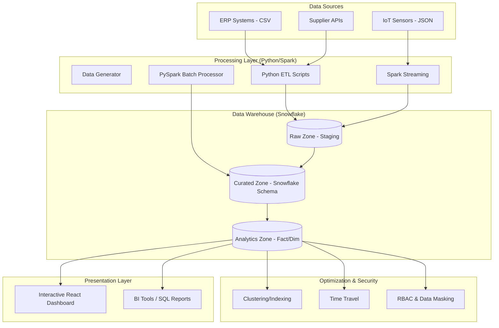

# Supply Chain Optimization System Architecture

## Overview
The system is designed as a modern cloud-native data platform, leveraging Snowflake for storage and optimization, and Python/Spark for processing and ETL.

## Architecture Diagram (Mermaid)

## Key Components

### 1. Data Modeling
- **Star Schema**: Optimized for analytical queries.
- **Snowflake Tables**: Using `VARIANT` for IoT data and `CLUSTER BY` for temporal partitioning.

### 2. ETL/ELT Pipeline
- **Python**: Used for lightweight orchestration and data movement.
- **Spark**: Handles large-scale transformations and window functions (e.g., cumulative inventory tracking).

### 3. Snowflake Optimization
- **Clustering**: Drastically reduces scan time for time-series queries.
- **Time Travel**: Allows querying data at any point in the last 90 days for audit and recovery.

### 4. Security & Governance
- **RBAC**: granular roles for Analysts and Engineers.
- **Dynamic Masking**: Protects sensitive supplier PII.

### 5. Visualization
- **React Dashboard**: Built with Vite and Chart.js for real-time visibility into shipment velocity and hub efficiency.
